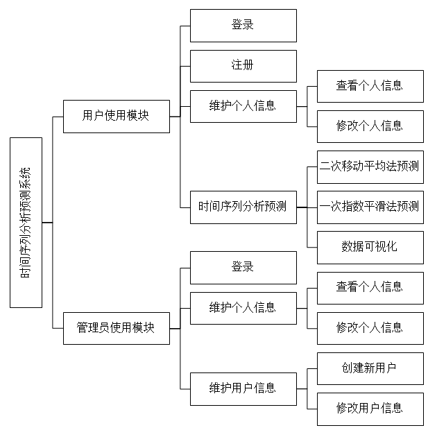
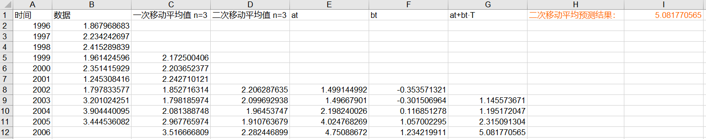
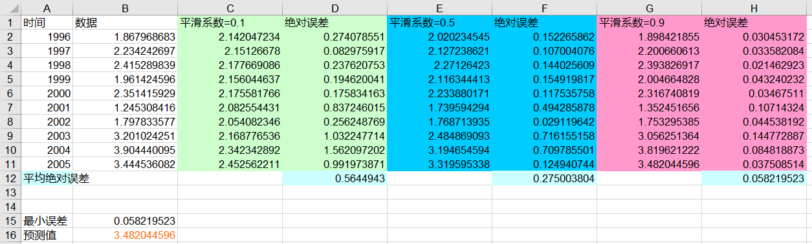

# TimeSeriesForecastSystemV1
Time Series Analysis and Forecast System
时间序列分析预测系统

最后更新：201705

# 系统总体结构图

# 技术栈
Spring Boot,
MyBatis,
Maven

MySQL

AngularJS,
jQuery,
Bootstrap,
ECharts

# 使用预测算法
## 二次移动平均法
[MA代码](/TimeSeriesForecastSystemV1/blob/master/TimeSeriesSys/src/main/java/com/gleamer/tool/MyMA.java)

运行结果：生成的xls格式文件截图

## 一次指数平滑法
[ES代码](/TimeSeriesForecastSystemV1/blob/master/TimeSeriesSys/src/main/java/com/gleamer/tool/MyES.java)
运行结果：生成的xls格式文件截图

